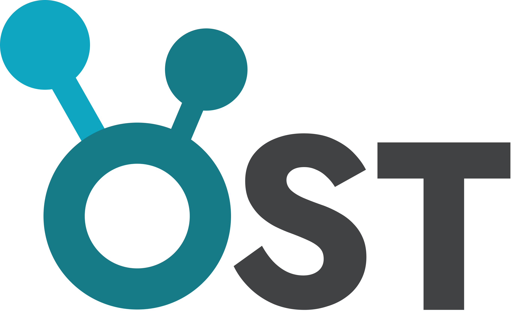

# OST Suite 

<p align="left"></p>

#### Human Osteo-Skeletal Tracker

OST Suite is a high-performance, distributed workstation for recording, processing, and visualizing multi-modal skeletal kinematics and micro-Doppler radar data. 


> **🚀 Stable Release:** Version 1.0.0 marks the first production-ready release of the OST Suite.

---

## 🏛️ Project Architecture

The suite is organized into a modular directory structure for scalability and maintainability:

```
src/
├── core/               (Internal application state & logic)
├── vision/             (Skeletal tracking & Depth estimation)
├── hardware/           (TI Radar & Intel RealSense drivers)
├── radar/              (DSP, FFT processing & Parsing)
├── studio/             (Offline Laboratory UI)
├── data/               (Parquet I/O & Data models)
├── maths/              (Filtering & Motion kinematics)
└── utils/              (Shared configs & Global themes)
```

---

## 🛰️ Core Modules

### 📡 OST Streamer (`stream.py`)
The hardware-interfacing node. Captures live telemetry, performs local parsing, and broadcasts encrypted streams via ZMQ. Features an automated **TOFU (Trust On First Use)** key server for seamless client connectivity.

### 🖥️ OST Viewer (`view.py`)
The live monitoring dashboard. Automatically handshakes with the Streamer to retrieve encryption keys and visualizes high-speed skeletal and radar heatmaps.

### 🧪 OST Studio (`app.py`)
The offline analysis laboratory. A Streamlit-based workbench for post-processing recorded `.parquet` sessions and gait analysis. Now features **Remote Access QR Codes** on the login screen for quick connectivity from mobile devices or other computers on the same network.

---

## 🔐 Security & TOFU

The suite uses **CurveZMQ (Curve25519)** for end-to-end encryption. 
With the new **TOFU Architecture**, manual key distribution is no longer required:
1. **Publisher** starts a background key-exchange thread on port `5554`.
2. **Listener** connects to the key port, retrieves the server's public key, and closes the temporary link.
3. **Listener** establishes the secure, encrypted data stream on ports `5555`/`5556`.

---

## 🚀 Quick Start

The suite now features **Zero-Configuration Setup**. Cryptographic keys and default settings are generated automatically on the first launch.

1. **Stream:** Run `python stream.py` on the computer connected to hardware.
2. **View:** Run `python view.py` on any computer in the network to watch the live feed.
3. **Analyze:** Run `python app.py` to launch the offline Studio laboratory.

> **Note:** On the first run, a `settings.ini` file will be created in the root directory. You can edit this file to change COM ports, IP addresses, or the default Studio password (initially set to `admin`).

---

## ⚙️ Supported Hardware

**Texas Instruments IWR6843ISK**
60-GHz mmWave radar sensor for non-intrusive velocity and point-cloud capture.

**Intel RealSense D435i**
RGB-Depth camera for precise skeletal kinematics and joint angle calculation.

## 🤝 Contributing

We welcome community contributions and improvements! To ensure the stability of the core system, please follow these guidelines:

1. **Software & UI:** Contributions to the Studio UI, data processing logic, and mathematical filters are highly encouraged.
2. **Hardware Drivers:** To maintain system integrity and hardware driver stability, **Pull Requests involving changes to the `src/hardware/` or `src/radar/` core drivers will not be accepted.**
3. **Bug Reports:** If you find a bug, please open an issue with detailed reproduction steps.
